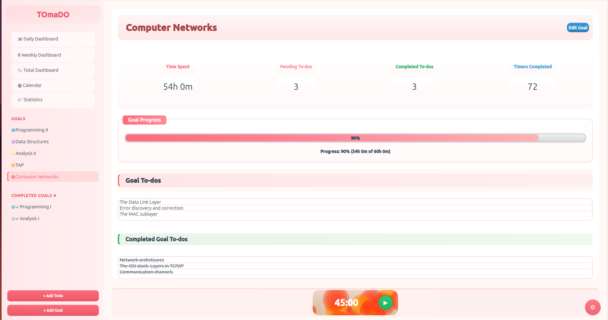
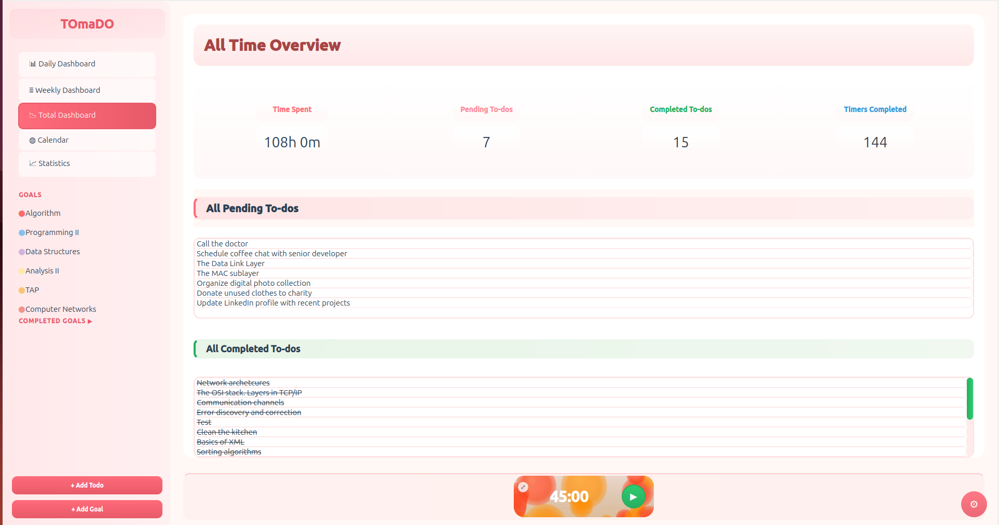
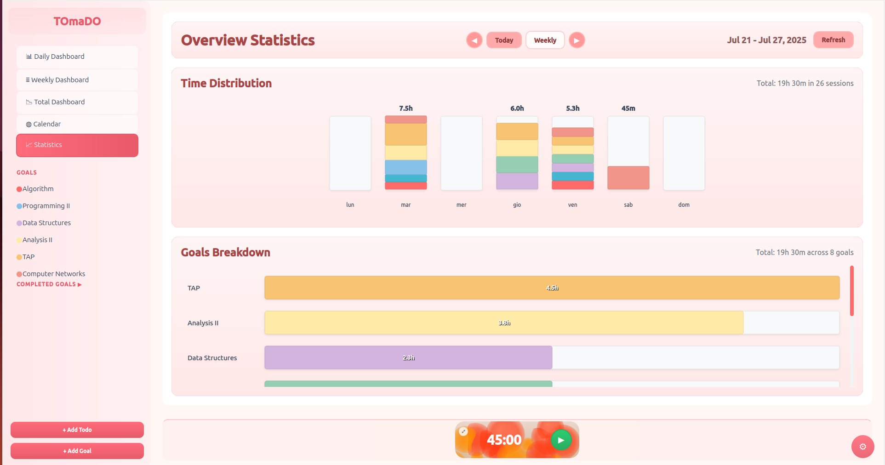
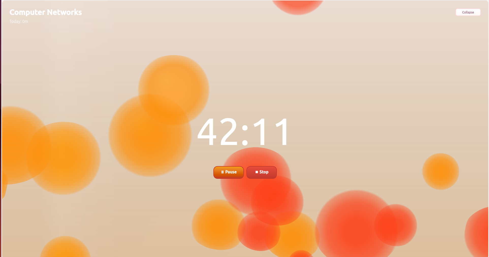
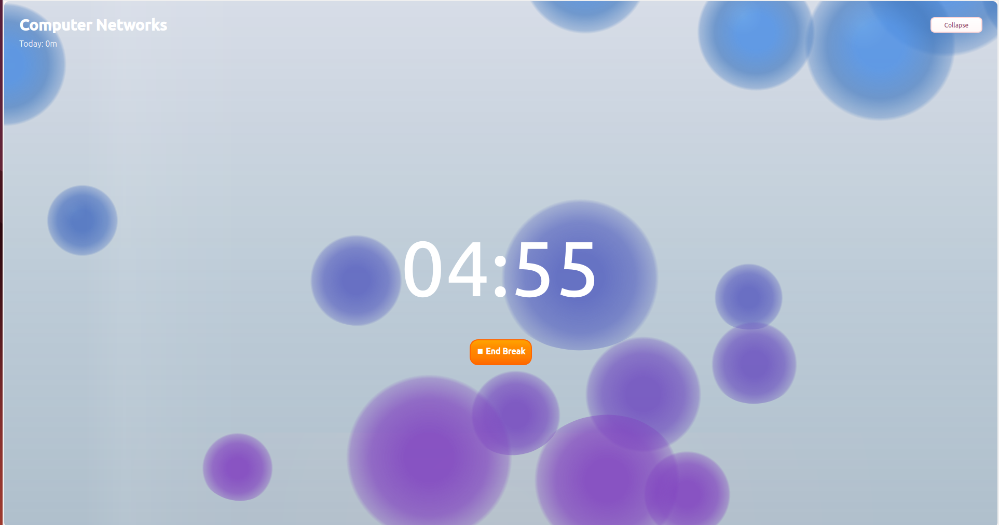

## TOmaDO - Task and Time Management Application
**TOmaDO** is a simple, Linux-friendly alternative to the popular [Focus To-Do](https://www.focustodo.cn/) app. 
It was created to fill a small but real gap for Linux users who need a straightforward tool for task and time management.
Try it by yourself downloading it from [here](https://github.com/Julieeno/TOmaDO/blob/main/tomado_1.0.0_amd64.deb).

### Motivation
I built TOmaDO because I was a regular user of Focus To-Do, which unfortunately isn’t available on Linux. 
I wasn’t aiming to create anything **groundbreaking**, just something similar that worked on my system. 
It also gave me a great excuse to experiment with technologies I don’t normally use in my day-to-day work, 
and to challenge myself with a small but meaningful project.

### Screenshots
The following screenshots showcase TOmaDO's interface and key features.

#### Goal Dashboard

*The goal dashboard provides a high-level view of your long-term objectives and progress. Set measurable goals with 
deadlines, track completion percentage, and break down larger goals into manageable tasks. 
This feature helps maintain focus on what matters most while providing a satisfying visual representation of your 
achievements over time.*

#### Total Dashboard

*The Total Dashboard provides a comprehensive overview of your productivity ecosystem. 
It displays key metrics like completed tasks, total focus time, goal progress, and upcoming deadlines all in one place. 
This central hub helps you understand your overall productivity patterns, identify areas for improvement, 
and celebrate your accomplishments across different areas of focus.*

#### Task Statistics and Reports

*The statistics dashboard displaying your productivity metrics over time. Track your completed tasks, 
focused work hours, and productivity patterns to help optimize your workflow.*

#### Focus Mode

*The Focus Mode features an expanded widget with a mesmerizing lava lamp animation effect. 
This distraction-free interface helps you enter a state of flow by providing a calming visual experience 
while displaying only essential timing information. 
Toggle this mode when you need to deeply concentrate on a single task.*

#### Break Timer

*Following the Pomodoro Technique's wisdom, the Break Timer reminds you that regular pauses boost productivity.*

### Features
- Task and goal management
- Timer functionality for focused work sessions
- Sound notifications
- Settings customization
- Local database for persistent storage
- Compact timer widget for minimalist view

### Project Structure
- - Source code files `src/`
- - Header files `include/`

### Installation

#### Using the DEB package
```sudo dpkg -i tomado_x.x.x_amd64.deb```

After installation, you can run TOmaDO directly from terminal typing `TOmaDO`.